# 📊 Text-to-Vector Conversion Flowcharts

*Visual Guide to Understanding How Text Becomes Numbers*

---

## 🎯 Overview Flow

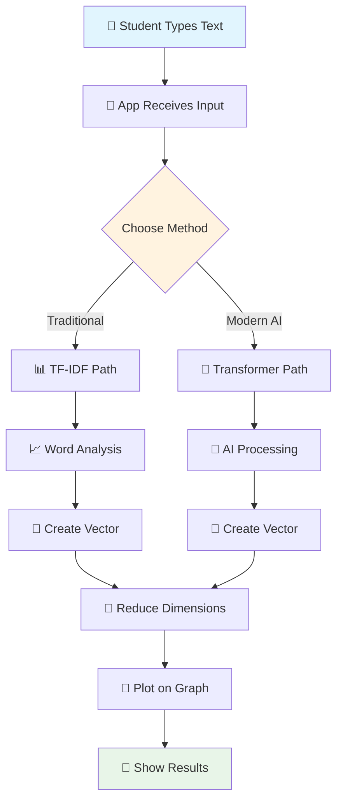

---

## 📊 TF-IDF Method Detailed Flow

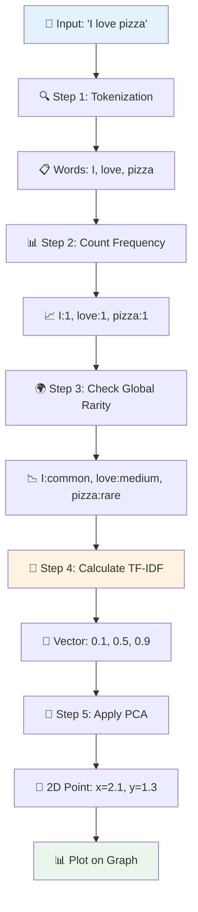

### 📋 TF-IDF Calculation Example

```mermaid
graph LR
    A[Term Frequency] --> C[×]
    B[Inverse Document Frequency] --> C
    C --> D[TF-IDF Score]
    
    subgraph "Example: 'pizza'"
        E[Appears 2 times in document] --> F[TF = 2/10 = 0.2]
        G[Appears in 1 out of 100 documents] --> H[IDF = log(100/1) = 2.0]
        F --> I[×]
        H --> I
        I --> J[Score = 0.2 × 2.0 = 0.4]
    end
    
    style J fill:#e8f5e8
```

---

## 🧠 AI Transformer Method Detailed Flow

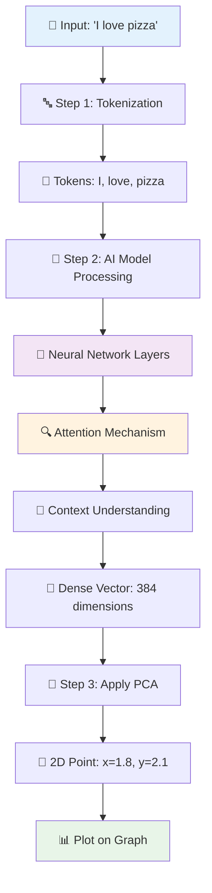

### 🤖 AI Processing Breakdown

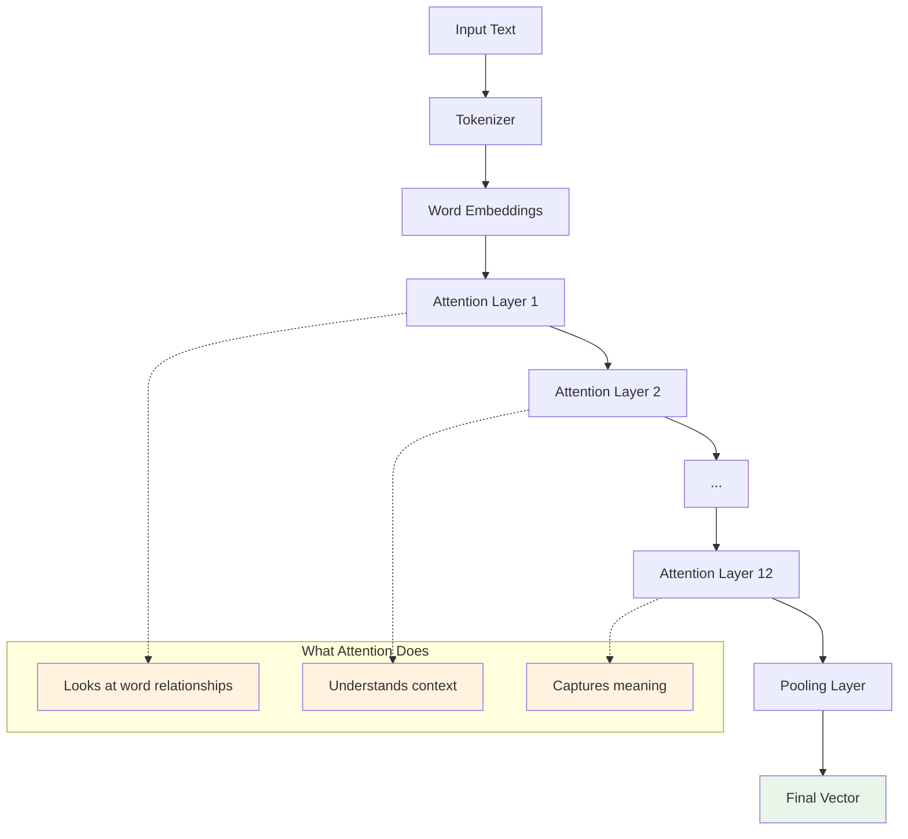

---

## 📐 Dimensionality Reduction (PCA) Flow

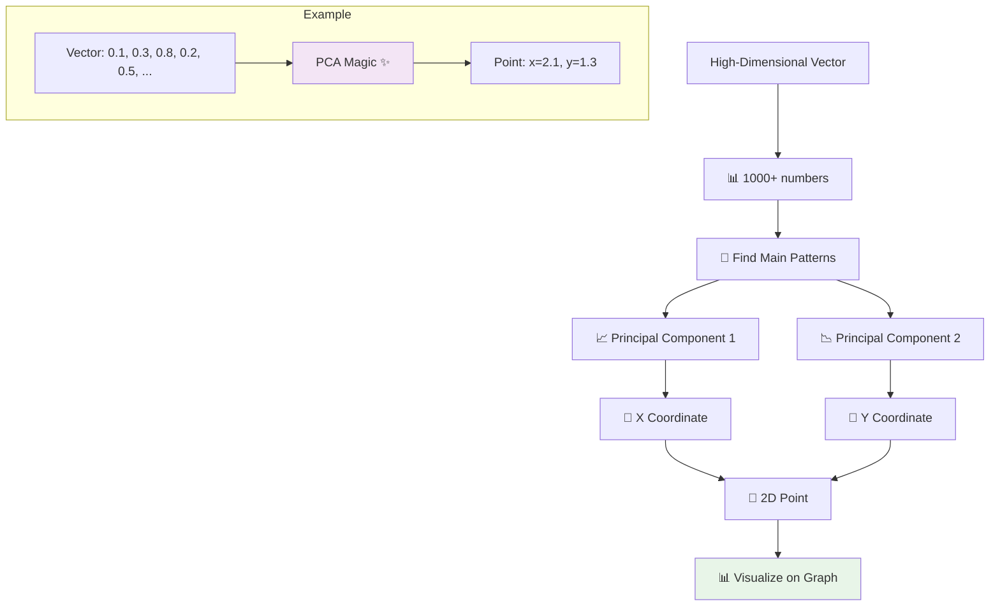

---

## 🎯 Similarity Calculation Flow

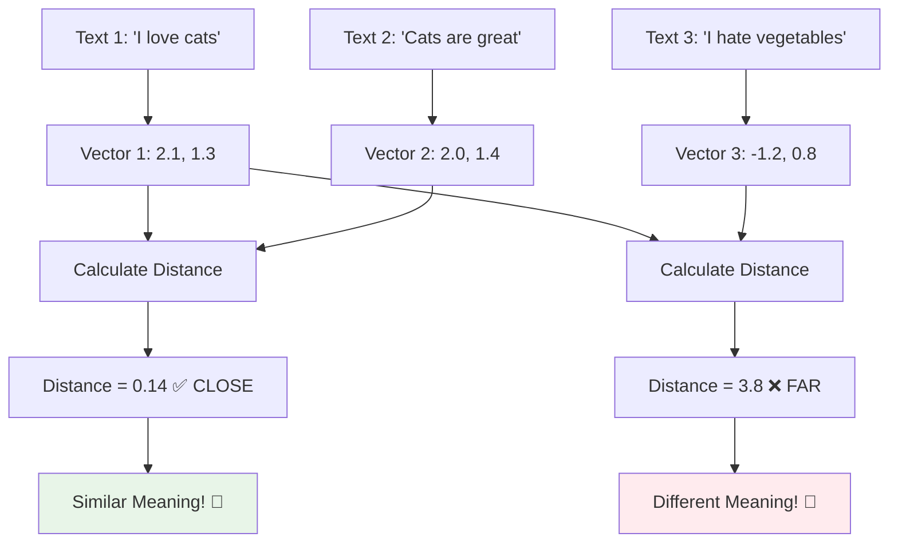

---

## 🔄 Complete User Journey Flow

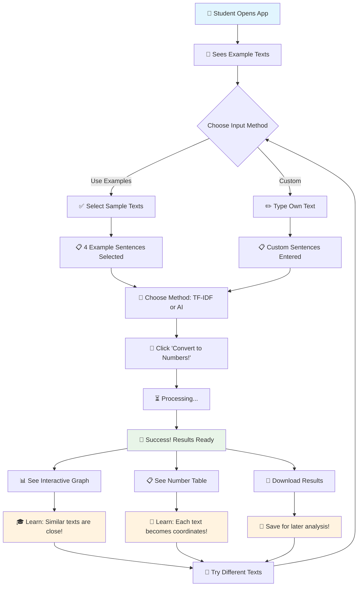

---

## 🧪 Experiment Flow Examples

### 🐱 Cat vs Dog Experiment

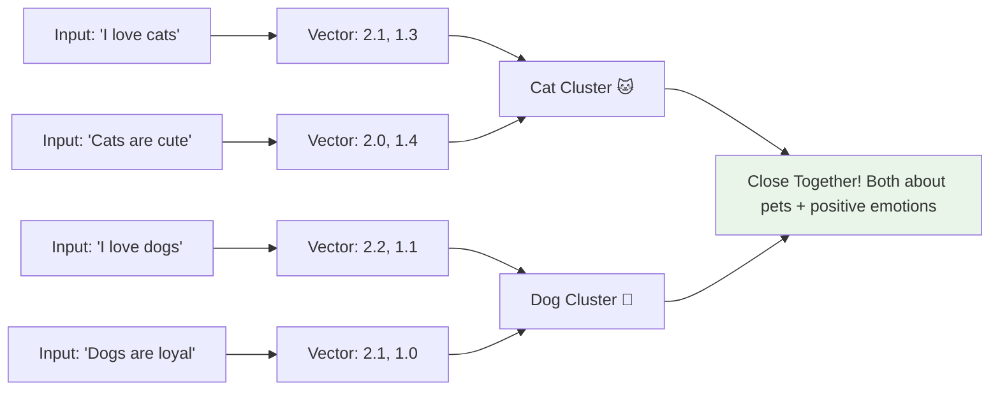

### 😊 Emotion Experiment

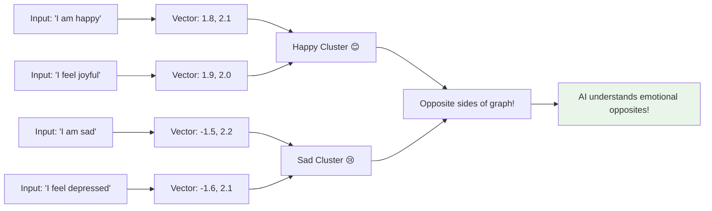

---

## 🎓 Learning Progression Flow

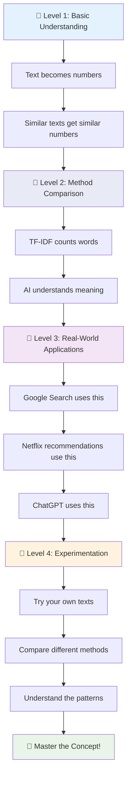

---

## 🔍 Debugging Flow (When Things Look Weird)

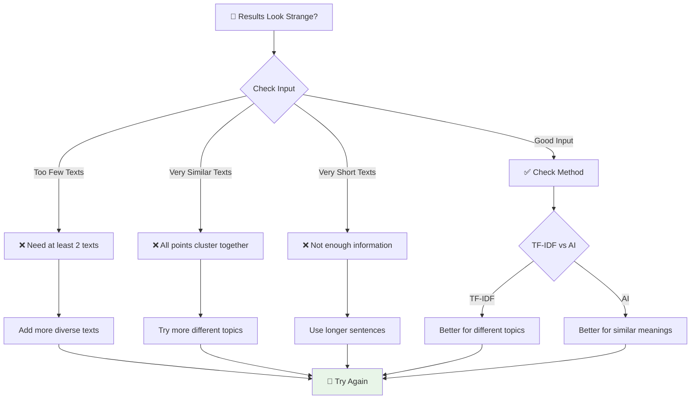

---

## 🎯 Success Indicators Flow

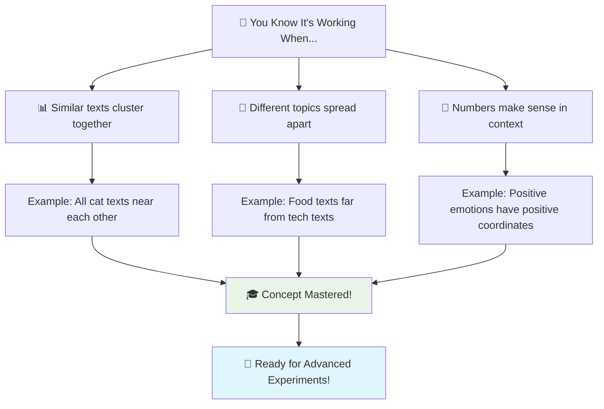

---

*These flowcharts help visualize the invisible process of turning human language into mathematical representations that computers can understand and work with!*