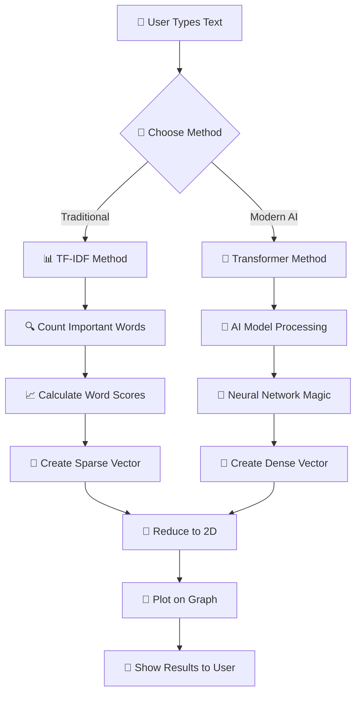

# 🧠 Understanding Text-to-Vector Conversion

*How Computers Turn Words Into Numbers They Can Understand*

---

## 🎯 What This Page Explains

This page explains the **magic** behind our Text-to-Vector Converter app. Instead of focusing on how to build or run the app, we'll explore **what's happening inside** when you type text and get numbers back.

Think of this as looking under the hood of a car to understand how the engine works!

---

## 🤔 The Big Question: Why Do We Need This?

### The Problem
Imagine you're trying to explain colors to a friend who has never seen colors before. You might say:
- "Red is like the feeling of warmth"
- "Blue is like the feeling of coolness"
- "Green is like the feeling of nature"

**Computers have the same problem with words!** They don't understand what "happy," "sad," or "pizza" means. They only understand numbers like `1`, `0`, `3.14`, etc.

### The Solution
We need to **translate** words into numbers in a way that preserves their meaning. This translation process is called **"text embedding"** or **"vectorization."**

---

## 🔄 The Complete Process Flow



---

## 📊 Method 1: TF-IDF (The Word Counter)

### 🎭 The Analogy
Imagine you're a detective trying to figure out what a document is about by looking at which words appear most often and which words are rare.

### 🔍 How It Works

#### Step 1: Count Words (Term Frequency)
```
Text: "I love pizza. Pizza is delicious."
Word counts:
- "I": 1 time
- "love": 1 time  
- "pizza": 2 times ⭐ (appears more = more important)
- "is": 1 time
- "delicious": 1 time
```

#### Step 2: Check Rarity (Inverse Document Frequency)
```
Across ALL documents:
- "the": appears in 90% of documents → common → less important
- "pizza": appears in 10% of documents → rare → more important ⭐
```

#### Step 3: Calculate Final Score
```
TF-IDF Score = (How often in this text) × (How rare overall)

"pizza" = 2 × (high rarity score) = HIGH SCORE ⭐
"the" = 5 × (low rarity score) = low score
```

#### Step 4: Create Vector
```
Each text becomes a list of numbers:
"I love pizza" → [0.1, 0.3, 0.8, 0.0, 0.2, ...]
                   ↑    ↑    ↑    ↑    ↑
                   I  love pizza the  is
```

### 🎯 What This Means
- **Similar topics** get similar numbers
- **Important words** get bigger numbers
- **Common words** (like "the", "and") get smaller numbers

---

## 🧠 Method 2: Transformer AI (The Smart Reader)

### 🎭 The Analogy
Imagine you have a super-smart friend who has read millions of books and can instantly understand the meaning and context of any sentence, even if the words are different.

### 🤖 How It Works

#### Step 1: AI Training (This Already Happened)
```
The AI model was trained on millions of text examples:
- "I'm happy" and "I'm joyful" → learned these are similar
- "Dog" and "puppy" → learned these are related
- "Paris is in France" → learned geographical relationships
```

#### Step 2: Understanding Context
```
Input: "I love pizza"

AI thinks:
- "love" in this context = positive emotion
- "pizza" = food item
- Overall meaning = positive sentiment about food
```

#### Step 3: Create Dense Vector
```
Instead of counting words, AI creates a "meaning fingerprint":
"I love pizza" → [0.2, -0.1, 0.8, 0.3, -0.4, 0.9, ...]
                  ↑     ↑    ↑    ↑     ↑    ↑
               emotion food positive taste comfort enjoyment
```

### 🎯 What This Means
- **Similar meanings** get similar vectors (even with different words)
- **Context matters** ("bank" near "river" vs "bank" near "money")
- **Relationships preserved** (king - man + woman ≈ queen)

---

## 📐 The Magic of 2D Visualization

### 🤔 The Challenge
Real vectors have hundreds or thousands of dimensions:
```
TF-IDF: [0.1, 0.3, 0.8, 0.0, 0.2, 0.5, 0.1, 0.9, ...]  (1000+ numbers)
AI Model: [0.2, -0.1, 0.8, 0.3, -0.4, 0.9, 0.1, ...]    (384+ numbers)
```

**Problem:** Humans can't visualize 1000-dimensional space!

### 🎯 The Solution: PCA (Principal Component Analysis)
Think of PCA as a "smart camera" that finds the best angle to take a photo of a 3D object on 2D paper.

```
1000D Vector → [📷 PCA Magic] → 2D Point (x, y)

"I love pizza"     → (2.3, 1.7)
"Pizza is great"   → (2.1, 1.9)  ← Close to above!
"I hate vegetables" → (-1.2, 0.8) ← Far from pizza texts!
```

### 📍 What You See on the Graph
- **Close points** = similar meanings
- **Far points** = different meanings
- **Clusters** = groups of related texts

---

## 🔬 Detailed Example Walkthrough

Let's trace what happens when you input these texts:

### 📝 Input Texts
1. "I love cats"
2. "Cats are amazing"
3. "I enjoy programming"
4. "Coding is fun"

### 🔄 TF-IDF Processing

#### Step 1: Word Analysis
```
Vocabulary across all texts: [I, love, cats, are, amazing, enjoy, programming, coding, is, fun]

Text 1 "I love cats":
- I: 1, love: 1, cats: 1, others: 0
- Vector: [1, 1, 1, 0, 0, 0, 0, 0, 0, 0]

Text 2 "Cats are amazing":
- cats: 1, are: 1, amazing: 1, others: 0
- Vector: [0, 0, 1, 1, 1, 0, 0, 0, 0, 0]
```

#### Step 2: TF-IDF Scoring
```
"cats" appears in 2/4 texts → medium rarity
"programming" appears in 1/4 texts → high rarity → higher score
```

#### Step 3: 2D Reduction
```
After PCA:
"I love cats" → (1.2, 0.8)
"Cats are amazing" → (1.0, 0.9)  ← Close to above (both about cats)
"I enjoy programming" → (-0.8, 1.1)
"Coding is fun" → (-0.9, 1.0)  ← Close to above (both about coding)
```

### 🧠 AI Processing

#### Step 1: Semantic Understanding
```
AI recognizes:
- "love" and "amazing" = positive emotions
- "cats" = animals/pets
- "programming" and "coding" = same concept
- "enjoy" and "fun" = positive emotions
```

#### Step 2: Dense Vectors
```
"I love cats" → [0.8, 0.2, -0.1, 0.9, ...]  (emotion: high, animal: high)
"Cats are amazing" → [0.7, 0.3, -0.1, 0.8, ...]  (similar to above)
"I enjoy programming" → [0.6, -0.8, 0.9, 0.1, ...]  (emotion: high, tech: high)
"Coding is fun" → [0.5, -0.7, 0.8, 0.2, ...]  (similar to above)
```

#### Step 3: 2D Visualization
```
After PCA:
"I love cats" → (2.1, 1.3)
"Cats are amazing" → (2.0, 1.4)  ← Very close (same topic + sentiment)
"I enjoy programming" → (-1.8, 0.9)
"Coding is fun" → (-1.7, 1.0)  ← Very close (same topic + sentiment)
```

---

## 🎨 Visual Representation

### 📊 What You See in the App

```
        Y
        ↑
        |  🐱 "I love cats"
        |  🐱 "Cats are amazing"
        |
--------+--------→ X
        |
        |     💻 "I enjoy programming"
        |     💻 "Coding is fun"
        |
```

### 🎯 Key Insights
1. **Cat texts cluster together** (top area)
2. **Programming texts cluster together** (bottom area)
3. **Distance represents similarity**
4. **Both methods show similar patterns** (but AI is more nuanced)

---

## 🌟 Real-World Applications

### 🔍 Search Engines (Google, Bing)
```
Your search: "best Italian food"
System converts to vector: [0.2, 0.8, 0.1, 0.9, ...]

Webpage about "delicious pasta recipes":
Converted to vector: [0.3, 0.7, 0.2, 0.8, ...]

Distance calculation: CLOSE → Show this result! ⭐
```

### 🎬 Recommendation Systems (Netflix, Spotify)
```
You liked: "Funny cat videos"
Vector: [0.9, 0.1, 0.8, ...]

Available content: "Hilarious pet compilation"
Vector: [0.8, 0.2, 0.7, ...]

Distance: CLOSE → "You might also like..." ⭐
```

### 🤖 Chatbots and AI Assistants
```
User: "I'm feeling sad"
Vector: [-0.8, 0.2, 0.1, ...]

Response options:
"I'm sorry to hear that" → [-0.7, 0.3, 0.1, ...] ← CLOSE ⭐
"That's great news!" → [0.8, 0.1, 0.2, ...] ← FAR ❌

Choose the close one!
```

---

## 🎓 Educational Takeaways

### 🧠 For Students
1. **Math is everywhere** - Even in understanding language!
2. **Patterns matter** - Similar things should be close together
3. **Context is key** - Same words can mean different things
4. **AI learns from examples** - Just like humans do

### 👨‍🏫 For Teachers
1. **Great introduction to AI concepts** without complex math
2. **Visual learning** - Students can see abstract concepts
3. **Cross-curricular** - Combines language, math, and computer science
4. **Hands-on experimentation** - Students can try their own texts

### 🔬 Key Concepts Demonstrated
- **Vector spaces** and **similarity**
- **Dimensionality reduction**
- **Machine learning** fundamentals
- **Natural language processing**
- **Data visualization**

---

## 🤔 Thought Experiments

### 🧪 Try These Ideas
1. **What happens with synonyms?**
   - Input: "happy" vs "joyful" vs "glad"
   - Prediction: Should be close together

2. **What about opposites?**
   - Input: "love" vs "hate"
   - Prediction: Should be far apart

3. **Different languages, same meaning?**
   - Input: "hello" vs "hola" vs "bonjour"
   - Question: Will AI recognize similarity?

4. **Context matters:**
   - Input: "I saw a bat" (animal) vs "I need a bat" (baseball)
   - Question: How does context change the vector?

---

## 🎯 Conclusion

Text-to-vector conversion is like giving computers a **universal translator** for human language. Instead of just seeing letters and words, computers can now understand:

- **Meaning** and **context**
- **Relationships** between concepts
- **Similarity** and **differences**
- **Emotions** and **sentiments**

This technology powers everything from Google Search to Netflix recommendations to ChatGPT. By understanding how text becomes numbers, we understand how modern AI works!

---

## 🚀 Next Steps

Want to explore more? Try these experiments in the app:
1. Input song lyrics and see how different genres cluster
2. Try movie descriptions and watch how similar movies group together
3. Input your own writing and see how your style compares to famous authors
4. Experiment with different languages and see what happens

**Remember:** Every time you use Google, ask Siri a question, or get a Netflix recommendation, this same process is happening behind the scenes! 🎉

---

*Made with ❤️ to help students understand the magic of AI*